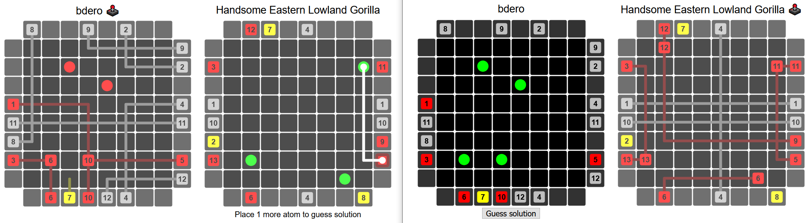

# blackbox

Black Box is a turn-based two player board game where each player places objects (called "atoms") on their own game board and then attempts to deduce the location of the opponent's atoms by casting rays across the opponent's game board.

This implementation supports games with exactly 4 atoms. See this [Wikipedia article](https://en.wikipedia.org/wiki/Black_Box_(game)#Rules) for the full set of raycast behavior rules.

## Running the server

1. Ensure that the SQLite3 CLI tool is installed and available in the executable `PATH`:
    * Arch Linux: `pacman -S sqlite`
    * Windows with Scoop: `scoop install sqlite3`
    * MacOS with Brew: `brew install sqlite`
1. Clone this repository: `git clone https://github.com/bdero/blackbox.git`
1. Install dependencies: `cd blackbox/server && npm install`
1. Run the server: `npm start`

The server should start listening for HTTP requests on port 8888.

**Note:** The server _only_ accepts WebSocket protocol upgrade requests and communicates strictly over WebSocket. It does not respond to generic HTTP requests or know how to serve the client to the browser.

## Running the client

1. Clone this repository: `git clone https://github.com/bdero/blackbox.git`
1. Install dependencies: `cd blackbox/client && npm install`
1. Run the server: `npm start`

## License (MIT)

Copyright © `2020` `Brandon DeRosier`

Permission is hereby granted, free of charge, to any person
obtaining a copy of this software and associated documentation
files (the “Software”), to deal in the Software without
restriction, including without limitation the rights to use,
copy, modify, merge, publish, distribute, sublicense, and/or sell
copies of the Software, and to permit persons to whom the
Software is furnished to do so, subject to the following
conditions:

The above copyright notice and this permission notice shall be
included in all copies or substantial portions of the Software.

THE SOFTWARE IS PROVIDED “AS IS”, WITHOUT WARRANTY OF ANY KIND,
EXPRESS OR IMPLIED, INCLUDING BUT NOT LIMITED TO THE WARRANTIES
OF MERCHANTABILITY, FITNESS FOR A PARTICULAR PURPOSE AND
NONINFRINGEMENT. IN NO EVENT SHALL THE AUTHORS OR COPYRIGHT
HOLDERS BE LIABLE FOR ANY CLAIM, DAMAGES OR OTHER LIABILITY,
WHETHER IN AN ACTION OF CONTRACT, TORT OR OTHERWISE, ARISING
FROM, OUT OF OR IN CONNECTION WITH THE SOFTWARE OR THE USE OR
OTHER DEALINGS IN THE SOFTWARE.
